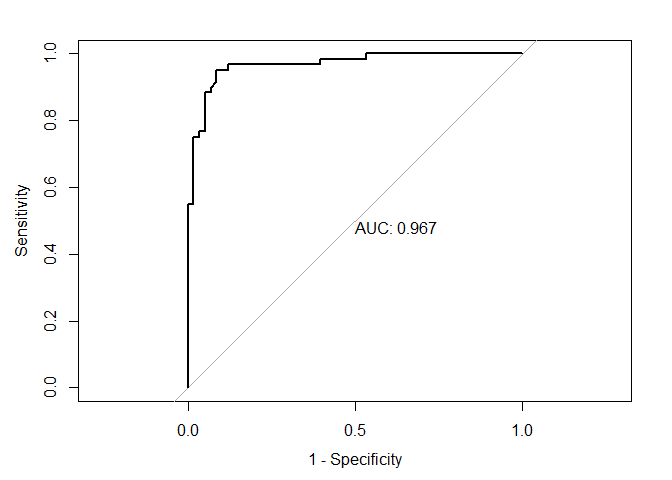

Data Science II: Homework 3
================

In this problem, you will develop a model to predict whether a given car
gets high or low gas mileage based on the dataset “auto.csv”. The
dataset contains 392 observations.

The response variable is “mpg cat”, which indicates whether the miles
per gallon of a car is high or low. The predictors include both
continuous and categorical variables:  
- **cylinders**: Number of cylinders between 4 and 8  
- **displacement**: Engine displacement (cu. inches)  
- **horsepower**: Engine horsepower  
- **weight**: Vehicle weight (lbs.)  
- **acceleration**: Time to accelerate from 0 to 60 mph (sec.)  
- **year**: Model year (modulo 100)  
- **origin**: Origin of car (1. American, 2. European, 3. Japanese) -
**mpg_cat**: *response variable* indicates whether the miles per gallon
of a car is ‘high’ or ‘low’

### Import Data

``` r
auto = read.csv("auto.csv")
head(auto)
```

    ##   cylinders displacement horsepower weight acceleration year origin mpg_cat
    ## 1         8          307        130   3504         12.0   70      1     low
    ## 2         8          350        165   3693         11.5   70      1     low
    ## 3         8          318        150   3436         11.0   70      1     low
    ## 4         8          304        150   3433         12.0   70      1     low
    ## 5         8          302        140   3449         10.5   70      1     low
    ## 6         8          429        198   4341         10.0   70      1     low

### Split the dataset into two parts: training data (70%) and test data (30%).

``` r
library(caret)
```

    ## Loading required package: ggplot2

    ## Loading required package: lattice

``` r
library(tidymodels)
```

    ## ── Attaching packages ────────────────────────────────────── tidymodels 1.3.0 ──

    ## ✔ broom        1.0.7     ✔ rsample      1.2.1
    ## ✔ dials        1.4.0     ✔ tibble       3.2.1
    ## ✔ dplyr        1.1.4     ✔ tidyr        1.3.1
    ## ✔ infer        1.0.7     ✔ tune         1.3.0
    ## ✔ modeldata    1.4.0     ✔ workflows    1.2.0
    ## ✔ parsnip      1.3.0     ✔ workflowsets 1.1.0
    ## ✔ purrr        1.0.4     ✔ yardstick    1.3.2
    ## ✔ recipes      1.1.1

    ## ── Conflicts ───────────────────────────────────────── tidymodels_conflicts() ──
    ## ✖ purrr::discard()         masks scales::discard()
    ## ✖ dplyr::filter()          masks stats::filter()
    ## ✖ dplyr::lag()             masks stats::lag()
    ## ✖ purrr::lift()            masks caret::lift()
    ## ✖ yardstick::precision()   masks caret::precision()
    ## ✖ yardstick::recall()      masks caret::recall()
    ## ✖ yardstick::sensitivity() masks caret::sensitivity()
    ## ✖ yardstick::specificity() masks caret::specificity()
    ## ✖ recipes::step()          masks stats::step()

``` r
datSplit = initial_split(data = auto, prop = 0.7)
trainData = training(datSplit)
testData = testing(datSplit)
head(trainData)
```

    ##   cylinders displacement horsepower weight acceleration year origin mpg_cat
    ## 1         4          140         88   2890         17.3   79      1     low
    ## 2         6          250         98   3525         19.0   77      1     low
    ## 3         8          350        155   4360         14.9   79      1     low
    ## 4         4           90         70   1937         14.2   76      2    high
    ## 5         4          134         95   2560         14.2   78      3    high
    ## 6         4          140         78   2592         18.5   75      1    high

``` r
trainData$mpg_cat = as.factor(trainData$mpg_cat)
testData$mpg_cat = as.factor(testData$mpg_cat)
```

#### (a) Perform logistic regression analysis. Are there redundant predictors in your model? If so, identify them. If there are none, please provide an explanation.

Yes, there are redundant predictors in the model. By using the
Pr(\>\|z\|) in the logistic regression model, the following variables
are redundant: cylinders, displacement, horsepower, acceleration, and
origin. The predictors stated above have p-values \> 0.05 and therefore
do not contribute to the model in a statistically significant way.

##### Perform logistic regression analysis

``` r
set.seed(2)
glmnGrid = expand.grid(.alpha = seq(0, 1, length = 21),
.lambda = exp(seq(-8, -1, length = 50)))

ctrl = trainControl(method = "cv", number = 10,
summaryFunction = twoClassSummary,
classProbs = TRUE)

glm.fit = train(x = trainData[, c("cylinders", "displacement", "horsepower", 
                                  "weight", "acceleration", "year", "origin")],  
                y = trainData$mpg_cat, 
                   method = "glm",   
                   family = "binomial",  
                   metric = "ROC", 
                   trControl = ctrl)

summary(glm.fit)  
```

    ## 
    ## Call:
    ## NULL
    ## 
    ## Coefficients:
    ##               Estimate Std. Error z value Pr(>|z|)    
    ## (Intercept)  18.281599   6.644998   2.751  0.00594 ** 
    ## cylinders     0.354913   0.516758   0.687  0.49221    
    ## displacement -0.008400   0.014505  -0.579  0.56252    
    ## horsepower    0.048896   0.028290   1.728  0.08392 .  
    ## weight        0.004031   0.001272   3.168  0.00153 ** 
    ## acceleration  0.035676   0.162749   0.219  0.82649    
    ## year         -0.444604   0.087684  -5.071 3.97e-07 ***
    ## origin       -0.786363   0.441547  -1.781  0.07492 .  
    ## ---
    ## Signif. codes:  0 '***' 0.001 '**' 0.01 '*' 0.05 '.' 0.1 ' ' 1
    ## 
    ## (Dispersion parameter for binomial family taken to be 1)
    ## 
    ##     Null deviance: 379.83  on 273  degrees of freedom
    ## Residual deviance: 112.57  on 266  degrees of freedom
    ## AIC: 128.57
    ## 
    ## Number of Fisher Scoring iterations: 8

##### Adjusting logistic regression model to include only non-redundant predictors

``` r
glm.fit2 = train(x = trainData[c("weight", "year")],  
                 y = trainData$mpg_cat,  
                 method = "glm",   
                 family = "binomial",  
                 metric = "ROC",  
                 trControl = ctrl)  

summary(glm.fit2)
```

    ## 
    ## Call:
    ## NULL
    ## 
    ## Coefficients:
    ##               Estimate Std. Error z value Pr(>|z|)    
    ## (Intercept) 20.0839119  5.2236977   3.845 0.000121 ***
    ## weight       0.0050031  0.0006956   7.192 6.37e-13 ***
    ## year        -0.4478779  0.0811277  -5.521 3.38e-08 ***
    ## ---
    ## Signif. codes:  0 '***' 0.001 '**' 0.01 '*' 0.05 '.' 0.1 ' ' 1
    ## 
    ## (Dispersion parameter for binomial family taken to be 1)
    ## 
    ##     Null deviance: 379.83  on 273  degrees of freedom
    ## Residual deviance: 123.09  on 271  degrees of freedom
    ## AIC: 129.09
    ## 
    ## Number of Fisher Scoring iterations: 7

#### (b) Train a multivariate adaptive regression spline (MARS) model. Does the MARS model improve prediction performance compared to logistic regression?

``` r
mars_grid = expand.grid(degree = 1:2,
                         nprune = 2:4)

ctrl1 = trainControl(method = "cv", number = 10)

trainData$mpg_cat = as.factor(trainData$mpg_cat)

set.seed(2)

mars.fit = train(x = trainData[, c("cylinders", "displacement", "horsepower", 
                                    "weight", "acceleration", "year", "origin")],  
                  y = trainData$mpg_cat,   
                 method = "earth",         
                 tuneGrid = mars_grid,     
                 trControl = ctrl1)        
```

    ## Loading required package: earth

    ## Loading required package: Formula

    ## Loading required package: plotmo

    ## Loading required package: plotrix

    ## 
    ## Attaching package: 'plotrix'

    ## The following object is masked from 'package:scales':
    ## 
    ##     rescale

``` r
ggplot(mars.fit)
```

<!-- -->

##### Prediction performance of Logistic Regression

``` r
glm.pred = predict(glm.fit2, newdata = testData, type = "raw")
head(glm.pred)
```

    ## [1] low low low low low low
    ## Levels: high low

##### Prediction performance of MARS

``` r
mars.pred = predict(mars.fit, newdata = testData, type = "raw")  
```

##### Model Performance Comparison

``` r
confusionMatrix(glm.pred, testData$mpg_cat)
```

    ## Confusion Matrix and Statistics
    ## 
    ##           Reference
    ## Prediction high low
    ##       high   52   2
    ##       low     6  58
    ##                                           
    ##                Accuracy : 0.9322          
    ##                  95% CI : (0.8708, 0.9703)
    ##     No Information Rate : 0.5085          
    ##     P-Value [Acc > NIR] : <2e-16          
    ##                                           
    ##                   Kappa : 0.8642          
    ##                                           
    ##  Mcnemar's Test P-Value : 0.2888          
    ##                                           
    ##             Sensitivity : 0.8966          
    ##             Specificity : 0.9667          
    ##          Pos Pred Value : 0.9630          
    ##          Neg Pred Value : 0.9062          
    ##              Prevalence : 0.4915          
    ##          Detection Rate : 0.4407          
    ##    Detection Prevalence : 0.4576          
    ##       Balanced Accuracy : 0.9316          
    ##                                           
    ##        'Positive' Class : high            
    ## 

``` r
confusionMatrix(mars.pred, testData$mpg_cat)
```

    ## Confusion Matrix and Statistics
    ## 
    ##           Reference
    ## Prediction high low
    ##       high   52   3
    ##       low     6  57
    ##                                           
    ##                Accuracy : 0.9237          
    ##                  95% CI : (0.8601, 0.9645)
    ##     No Information Rate : 0.5085          
    ##     P-Value [Acc > NIR] : <2e-16          
    ##                                           
    ##                   Kappa : 0.8473          
    ##                                           
    ##  Mcnemar's Test P-Value : 0.505           
    ##                                           
    ##             Sensitivity : 0.8966          
    ##             Specificity : 0.9500          
    ##          Pos Pred Value : 0.9455          
    ##          Neg Pred Value : 0.9048          
    ##              Prevalence : 0.4915          
    ##          Detection Rate : 0.4407          
    ##    Detection Prevalence : 0.4661          
    ##       Balanced Accuracy : 0.9233          
    ##                                           
    ##        'Positive' Class : high            
    ## 

The MARS model does not significantly improve prediction performance
compared to logistic regression. Both models achieve high accuracy.
Logistic regression has a slightly higher overall accuracy and
specificity, while MARS has a slightly better sensitivity, meaning it
identifies high-mileage cars more effectively.

However, the differences are minimal, and both models perform well.
Since there is no substantial improvement in predictive performance,
logistic regression may be preferable due to its interpretability and
simplicity.

#### (c) Perform linear discriminant analysis using the training data. Plot the linear discriminant(s)

``` r
library(MASS)       
```

    ## 
    ## Attaching package: 'MASS'

    ## The following object is masked from 'package:dplyr':
    ## 
    ##     select

``` r
library(ggplot2)   
library(caret) 

ctrl3 = trainControl(method = "repeatedcv", repeats = 5,
summaryFunction = twoClassSummary,
classProbs = TRUE)

set.seed(22)

model.lda = train(x = trainData[, c("cylinders", "displacement", "horsepower", 
                                    "weight", "acceleration", "year", "origin")],  
                  y = trainData$mpg_cat,
                  method = "lda",
                  metric = "ROC",
                  trControl = ctrl3)

print(model.lda)
```

    ## Linear Discriminant Analysis 
    ## 
    ## 274 samples
    ##   7 predictor
    ##   2 classes: 'high', 'low' 
    ## 
    ## No pre-processing
    ## Resampling: Cross-Validated (10 fold, repeated 5 times) 
    ## Summary of sample sizes: 248, 246, 247, 247, 247, 247, ... 
    ## Resampling results:
    ## 
    ##   ROC        Sens       Spec     
    ##   0.9544584  0.9668132  0.8272527

``` r
lda.pred2 = predict(model.lda, newdata = testData)
```

The Linear Discriminant Analysis (LDA) model performed well in
distinguishing between the two classes (‘high’ and ‘low’) of \`mpg_cat’.
The ROC (=0.95) suggests excellent overall model discrimination. The
sensitivity of 96.35% shows that the model is very effective at
identifying instances of the ‘high’ class, while the specificity of
82.82% indicates that it is reasonably good at classifying the ‘low’
class.

Overall, the model is performing well, with strong ability to correctly
classify both classes.

#### (d) Which model will you choose to predict the response variable? Plot its ROC curve and report the AUC. Next, select a probability threshold to classify observations and compute the confusion matrix. Briefly interpret what the confusion matrix indicates about your model’s performance.

The MARS model has the highest accuracy and sensitivity. Therefore, it
is the most reliable at predicting both classes (‘high’ and ‘low’).
While the LDA model also had a good performance, in terms of ROC and
sensitivity, it had a lower specificity. This suggests the LDA model did
poorer in correctly classifying the ‘low’ class compared to the GLM and
MARS models.

Therefore, the MARS model is the best to predict the response variable,
mpg_cat. The ROC curve was plotted and the AUC is 0.981.

The confusion matrix shows that the model performs well in predicting
both “high” and “low” gas mileage cars, with an overall accuracy of
92.37%. The strong Kappa value (0.8455) indicates a high level of
agreement between the predicted and actual outcomes. Overall, the model
demonstrates strong performance, especially in identifying high-mileage
cars.

##### ROC Curve

``` r
library(pROC)
```

    ## Type 'citation("pROC")' for a citation.

    ## 
    ## Attaching package: 'pROC'

    ## The following objects are masked from 'package:stats':
    ## 
    ##     cov, smooth, var

``` r
mars.prob = predict(mars.fit, newdata = testData, type = "prob")[, 2]  

roc.mars = roc(testData$mpg_cat, mars.prob)
```

    ## Setting levels: control = high, case = low

    ## Setting direction: controls < cases

``` r
plot(roc.mars, legacy.axes = TRUE, print.auc = TRUE)
```

<!-- --> \#####
Confusion Matrix

``` r
test.pred.prob <- predict(mars.fit, newdata = testData, type = "prob")

test.pred.prob_pos <- test.pred.prob[, "high"]  # Assuming "high" is the positive class

test.pred <- ifelse(test.pred.prob_pos > 0.5, "high", "low")  # Binary classification: "high" or "low"

test.pred <- factor(test.pred, levels = levels(testData$mpg_cat))

confusionMatrix(data = as.factor(test.pred), 
                reference = testData$mpg_cat, 
                positive = "high")  # Change to "low" if "low" is the positive class
```

    ## Confusion Matrix and Statistics
    ## 
    ##           Reference
    ## Prediction high low
    ##       high   52   3
    ##       low     6  57
    ##                                           
    ##                Accuracy : 0.9237          
    ##                  95% CI : (0.8601, 0.9645)
    ##     No Information Rate : 0.5085          
    ##     P-Value [Acc > NIR] : <2e-16          
    ##                                           
    ##                   Kappa : 0.8473          
    ##                                           
    ##  Mcnemar's Test P-Value : 0.505           
    ##                                           
    ##             Sensitivity : 0.8966          
    ##             Specificity : 0.9500          
    ##          Pos Pred Value : 0.9455          
    ##          Neg Pred Value : 0.9048          
    ##              Prevalence : 0.4915          
    ##          Detection Rate : 0.4407          
    ##    Detection Prevalence : 0.4661          
    ##       Balanced Accuracy : 0.9233          
    ##                                           
    ##        'Positive' Class : high            
    ## 
