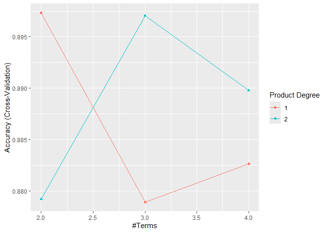

Data Science II: Homework 3
================

In this problem, you will develop a model to predict whether a given car
gets high or low gas mileage based on the dataset “auto.csv”. The
dataset contains 392 observations.

The response variable is “mpg cat”, which indicates whether the miles
per gallon of a car is high or low. The predictors include both
continuous and categorical variables:  
- **cylinders**: Number of cylinders between 4 and 8  
- **displacement**: Engine displacement (cu. inches)  
- **horsepower**: Engine horsepower  
- **weight**: Vehicle weight (lbs.)  
- **acceleration**: Time to accelerate from 0 to 60 mph (sec.)  
- **year**: Model year (modulo 100)  
- **origin**: Origin of car (1. American, 2. European, 3. Japanese) -
**mpg_cat**: *response variable* indicates whether the miles per gallon
of a car is ‘high’ or ‘low’

### Import Data

``` r
auto = read.csv("auto.csv")
head(auto)
```

    ##   cylinders displacement horsepower weight acceleration year origin mpg_cat
    ## 1         8          307        130   3504         12.0   70      1     low
    ## 2         8          350        165   3693         11.5   70      1     low
    ## 3         8          318        150   3436         11.0   70      1     low
    ## 4         8          304        150   3433         12.0   70      1     low
    ## 5         8          302        140   3449         10.5   70      1     low
    ## 6         8          429        198   4341         10.0   70      1     low

### Split the dataset into two parts: training data (70%) and test data (30%).

``` r
library(caret)
```

    ## Loading required package: ggplot2

    ## Loading required package: lattice

``` r
library(tidymodels)
```

    ## ── Attaching packages ────────────────────────────────────── tidymodels 1.3.0 ──

    ## ✔ broom        1.0.7     ✔ rsample      1.2.1
    ## ✔ dials        1.4.0     ✔ tibble       3.2.1
    ## ✔ dplyr        1.1.4     ✔ tidyr        1.3.1
    ## ✔ infer        1.0.7     ✔ tune         1.3.0
    ## ✔ modeldata    1.4.0     ✔ workflows    1.2.0
    ## ✔ parsnip      1.3.0     ✔ workflowsets 1.1.0
    ## ✔ purrr        1.0.4     ✔ yardstick    1.3.2
    ## ✔ recipes      1.1.1

    ## ── Conflicts ───────────────────────────────────────── tidymodels_conflicts() ──
    ## ✖ purrr::discard()         masks scales::discard()
    ## ✖ dplyr::filter()          masks stats::filter()
    ## ✖ dplyr::lag()             masks stats::lag()
    ## ✖ purrr::lift()            masks caret::lift()
    ## ✖ yardstick::precision()   masks caret::precision()
    ## ✖ yardstick::recall()      masks caret::recall()
    ## ✖ yardstick::sensitivity() masks caret::sensitivity()
    ## ✖ yardstick::specificity() masks caret::specificity()
    ## ✖ recipes::step()          masks stats::step()

``` r
datSplit <- initial_split(data = auto, prop = 0.7)
trainData <- training(datSplit)
testData <- testing(datSplit)
head(trainData)
```

    ##   cylinders displacement horsepower weight acceleration year origin mpg_cat
    ## 1         4           91         70   1955         20.5   71      1    high
    ## 2         4          105         70   2150         14.9   79      1    high
    ## 3         4          135         84   2370         13.0   82      1    high
    ## 4         4           98         65   2045         16.2   81      1    high
    ## 5         4          105         74   1980         15.3   82      2    high
    ## 6         4          113         95   2278         15.5   72      3    high

#### (a) Perform logistic regression analysis. Are there redundant predictors in your model? If so, identify them. If there are none, please provide an explanation.

Yes, there are redundant predictors in the model. By using the
Pr(\>\|z\|) in the logistic regression model, the following variables
are redundant: cylinders, displacement, horsepower, acceleration, and
origin. The predictors stated above have p-values \> 0.05 and therefore
do not contribute to the model in a statistically significant way.

- Perform logistic regression analysis

``` r
set.seed(2)
glmnGrid <- expand.grid(.alpha = seq(0, 1, length = 21),
.lambda = exp(seq(-8, -1, length = 50)))

ctrl <- trainControl(method = "cv", number = 10,
summaryFunction = twoClassSummary,
classProbs = TRUE)

model.glm <- train(x = trainData[1:7], 
                   y = trainData$mpg_cat, 
                   method = "glm",   
                   family = "binomial",  
                   metric = "ROC", 
                   trControl = ctrl)

summary(model.glm)  
```

    ## 
    ## Call:
    ## NULL
    ## 
    ## Coefficients:
    ##               Estimate Std. Error z value Pr(>|z|)    
    ## (Intercept)  23.620820   7.730071   3.056  0.00225 ** 
    ## cylinders     0.316739   0.536816   0.590  0.55517    
    ## displacement -0.007226   0.014111  -0.512  0.60856    
    ## horsepower    0.034311   0.031904   1.075  0.28217    
    ## weight        0.004890   0.001398   3.497  0.00047 ***
    ## acceleration -0.139271   0.180495  -0.772  0.44035    
    ## year         -0.502439   0.101394  -4.955 7.22e-07 ***
    ## origin       -0.368474   0.439412  -0.839  0.40172    
    ## ---
    ## Signif. codes:  0 '***' 0.001 '**' 0.01 '*' 0.05 '.' 0.1 ' ' 1
    ## 
    ## (Dispersion parameter for binomial family taken to be 1)
    ## 
    ##     Null deviance: 379.83  on 273  degrees of freedom
    ## Residual deviance: 105.32  on 266  degrees of freedom
    ## AIC: 121.32
    ## 
    ## Number of Fisher Scoring iterations: 8

#### (b) Train a multivariate adaptive regression spline (MARS) model. Does the MARS model improve prediction performance compared to logistic regression?

``` r
mars_grid <- expand.grid(degree = 1:2,
                         nprune = 2:4)

ctrl1 <- trainControl(method = "cv", number = 10)

trainData$mpg_cat <- as.factor(trainData$mpg_cat)

set.seed(2)

mars.fit <- train(x = trainData[, 1:7],  
                 y = trainData$mpg_cat,   
                 method = "earth",         
                 tuneGrid = mars_grid,     
                 trControl = ctrl1)        
```

    ## Loading required package: earth

    ## Loading required package: Formula

    ## Loading required package: plotmo

    ## Loading required package: plotrix

    ## 
    ## Attaching package: 'plotrix'

    ## The following object is masked from 'package:scales':
    ## 
    ##     rescale

``` r
ggplot(mars.fit)
```

<!-- -->

- Prediction performance of logistic regression analysis

- Prediction performance of MARS

#### (c) Perform linear discriminant analysis using the **training** data. Plot the linear discriminant(s)

#### (d) Which model will you choose to predict the response variable? Plot its ROC curve and report the AUC. Next, select a probability threshold to classify observations and compute the confusion matrix. Briefly interpret what the confusion matrix indicates about your model’s performance.
